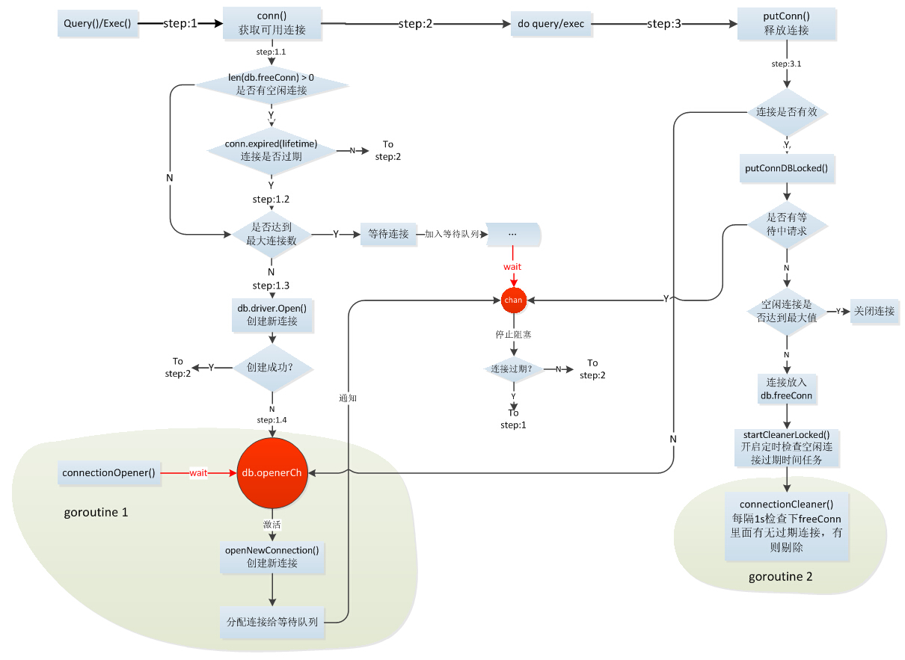

# go 使用mysql

database/sql/driver 提供了接口标准，具体实现由第三方提供。
## 驱动
github.com/go-sql-driver/mysql
### 下载驱动
```
go get github.com/go-sql-driver/mysql
```
### 驱动注册
import _ "github.com/go-sql-driver/mysql"前面的”_”作用时不需要把该包都导进来，只执行包的init()方法，mysql驱动正是通过这种方式注册到”database/sql”中的：
``` go
//github.com/go-sql-driver/mysql/driver.go
func init() {
    sql.Register("mysql", &MySQLDriver{})
}

type MySQLDriver struct{}

func (d MySQLDriver) Open(dsn string) (driver.Conn, error) {
    ...
}
```
init()通过Register()方法将mysql驱动添加到sql.drivers(类型：make(map[string]driver.Driver))中,MySQLDriver实现了driver.Driver接口：
``` go 
//database/sql/sql.go
func Register(name string, driver driver.Driver) {
    driversMu.Lock()
    defer driversMu.Unlock()
    if driver == nil {
        panic("sql: Register driver is nil")
    }
    if _, dup := drivers[name]; dup {
        panic("sql: Register called twice for driver " + name)
    }
    drivers[name] = driver
}
```
``` go
//database/sql/driver/driver.go
type Driver interface {
    // Open returns a new connection to the database.
    // The name is a string in a driver-specific format.
    //
    // Open may return a cached connection (one previously
    // closed), but doing so is unnecessary; the sql package
    // maintains a pool of idle connections for efficient re-use.
    //
    // The returned connection is only used by one goroutine at a
    // time.
    Open(name string) (Conn, error)
}
```
假如我们同时用到多种数据库，就可以通过调用sql.Register将不同数据库的实现注册到sql.drivers中去，用的时候再根据注册的name将对应的driver取出。
## 连接池

### 初始化
``` go
db, err := sql.Open("mysql", "username:password@tcp(host)/db_name?charset=utf8&allowOldPasswords=1")
```

sql.Open()是取出对应的db，这时mysql还没有建立连接，只是初始化了一个sql.DB结构，这是非常重要的一个结构，所有相关的数据都保存在此结构中；Open同时启动了一个connectionOpener协程，后面再具体分析其作用。

``` go
type DB struct {
    driver driver.Driver  //数据库实现驱动
    dsn    string  //数据库连接、配置参数信息，比如username、host、password等
    numClosed uint64

    mu           sync.Mutex          //锁，操作DB各成员时用到
    freeConn     []*driverConn       //空闲连接
    connRequests []chan connRequest  //阻塞请求队列，等连接数达到最大限制时，后续请求将插入此队列等待可用连接
    numOpen      int                 //已建立连接或等待建立连接数
    openerCh    chan struct{}        //用于connectionOpener
    closed      bool
    dep         map[finalCloser]depSet
    lastPut     map[*driverConn]string // stacktrace of last conn's put; debug only
    maxIdle     int                    //最大空闲连接数
    maxOpen     int                    //数据库最大连接数
    maxLifetime time.Duration          //连接最长存活期，超过这个时间连接将不再被复用
    cleanerCh   chan struct{}
}
``` 
### 获取连接 
上面说了Open时是没有建立数据库连接的，只有等用的时候才会实际建立连接，获取可用连接的操作有两种策略：cachedOrNewConn(有可用空闲连接则优先使用，没有则创建)、alwaysNewConn(不管有没有空闲连接都重新创建)，下面以一个query的例子看下具体的操作：
``` go
rows, err := db.Query("select * from test")
```
database/sql/sql.go 的实现
``` go
func (db *DB) Query(query string, args ...interface{}) (*Rows, error) {
    var rows *Rows
    var err error
    //maxBadConnRetries = 2
    for i := 0; i < maxBadConnRetries; i++ {
        rows, err = db.query(query, args, cachedOrNewConn)
        if err != driver.ErrBadConn {
            break
        }
    }
    if err == driver.ErrBadConn {
        return db.query(query, args, alwaysNewConn)
    }
    return rows, err
}

func (db *DB) query(query string, args []interface{}, strategy connReuseStrategy) (*Rows, error) {
    ci, err := db.conn(strategy)
    if err != nil {
        return nil, err
    }

    //到这已经获取到了可用连接，下面进行具体的数据库操作
    return db.queryConn(ci, ci.releaseConn, query, args)
}
```
conn 实现
``` go
func (db *DB) conn(strategy connReuseStrategy) (*driverConn, error) {
    db.mu.Lock()
    if db.closed {
        db.mu.Unlock()
        return nil, errDBClosed
    }
    lifetime := db.maxLifetime

    //从freeConn取一个空闲连接
    numFree := len(db.freeConn)
    if strategy == cachedOrNewConn && numFree > 0 {
        conn := db.freeConn[0]
        copy(db.freeConn, db.freeConn[1:])
        db.freeConn = db.freeConn[:numFree-1]
        conn.inUse = true
        db.mu.Unlock()
        if conn.expired(lifetime) {
            conn.Close()
            return nil, driver.ErrBadConn
        }
        return conn, nil
    }

    //如果没有空闲连接，而且当前建立的连接数已经达到最大限制则将请求加入connRequests队列，
    //并阻塞在这里，直到其它协程将占用的连接释放或connectionOpenner创建
    if db.maxOpen > 0 && db.numOpen >= db.maxOpen {
        // Make the connRequest channel. It's buffered so that the
        // connectionOpener doesn't block while waiting for the req to be read.
        req := make(chan connRequest, 1)
        db.connRequests = append(db.connRequests, req)
        db.mu.Unlock()
        ret, ok := <-req  //阻塞
        if !ok {
            return nil, errDBClosed
        }
        if ret.err == nil && ret.conn.expired(lifetime) { //连接过期了
            ret.conn.Close()
            return nil, driver.ErrBadConn
        }
        return ret.conn, ret.err
    }

    db.numOpen++ //上面说了numOpen是已经建立或即将建立连接数，这里还没有建立连接，只是乐观的认为后面会成功，失败的时候再将此值减1
    db.mu.Unlock()
    ci, err := db.driver.Open(db.dsn) //调用driver的Open方法建立连接
    if err != nil { //创建连接失败
        db.mu.Lock()
        db.numOpen-- // correct for earlier optimism
        db.maybeOpenNewConnections()  //通知connectionOpener协程尝试重新建立连接，否则在db.connRequests中等待的请求将一直阻塞，知道下次有连接建立
        db.mu.Unlock()
        return nil, err
    }
    db.mu.Lock()
    dc := &driverConn{
        db:        db,
        createdAt: nowFunc(),
        ci:        ci,
    }
    db.addDepLocked(dc, dc)
    dc.inUse = true
    db.mu.Unlock()
    return dc, nil
}
```
## 释放连接 
``` go
func (db *DB) putConn(dc *driverConn, err error) {
    ...

    //如果连接已经无效，则不再放入连接池
    if err == driver.ErrBadConn {
        db.maybeOpenNewConnections()
        dc.Close() //这里最终将numOpen数减掉
        return
    }
    ...

    //正常归还
    added := db.putConnDBLocked(dc, nil)
    ...
}

func (db *DB) putConnDBLocked(dc *driverConn, err error) bool {
    if db.maxOpen > 0 && db.numOpen > db.maxOpen {
        return false
    }
    //有等待连接的请求则将连接发给它们，否则放入freeConn
    if c := len(db.connRequests); c > 0 {
        req := db.connRequests[0]
        // This copy is O(n) but in practice faster than a linked list.
        // TODO: consider compacting it down less often and
        // moving the base instead?
        copy(db.connRequests, db.connRequests[1:])
        db.connRequests = db.connRequests[:c-1]
        if err == nil {
            dc.inUse = true
        }
        req <- connRequest{
            conn: dc,
            err:  err,
        }
        return true
    } else if err == nil && !db.closed && db.maxIdleConnsLocked() > len(db.freeConn) {
        db.freeConn = append(db.freeConn, dc)
        db.startCleanerLocked()
        return true
    }
    return false
}
```
## Exec和Query
a.Exec(update、insert、delete等无结果集返回的操作)调用完后会自动释放连接；
b.Query(返回sql.Rows)则不会释放连接，调用完后仍然占有连接，它将连接的所属权转移给了sql.Rows，所以需要手动调用close归还连接，即使不用Rows也得调用rows.Close()，否则可能导致后续使用出错，如下的用法是错误的：
```go
//错误
db.SetMaxOpenConns(1)
db.Query("select * from test")

row,err := db.Query("select * from test") //此操作将一直阻塞

//正确
db.SetMaxOpenConns(1)
r,_ := db.Query("select * from test")
r.Close() //将连接的所属权归还，释放连接
row,err := db.Query("select * from test")
//other op
row.Close()
```
## 具体例子
### 创建一个数据库
``` sql
mysql> create database piconline;
mysql> use database
mysql> create table user(
        id            bigint auto_increment
            primary key,
        name          varchar(100) not null,
        email         varchar(40)  not null,
        register_time bigint       not null
       );
       
```
ENGINE 设置存储引擎，CHARSET 设置编码
### 驱动注册 
```go
package main

import _ "github.com/go-sql-driver/mysql"

func main() {
	
}
```

### 连接配置 
``` go
package main

import (
	"database/sql"
	_ "github.com/go-sql-driver/mysql"
	"fmt"
)

func main() {
	db, err := sql.Open("mysql", "root:123456@tcp(0.0.0.0:3306)/piconline?charset=utf8")
	if err != nil {
		println(err)
	}
	fmt.Println(db)
}
```
``` 
> &{{root:123456@tcp(0.0.0.0:3306)/piconline?charset=utf8 0x1323760} 0 {0 0} [] map[] 0 0 0xc420078120 0xc420062060 false map[] map[] 0 0 0 <nil> 0x10aa600}
```
### 增
```go
	db.Exec("insert into  user (user_name, user_email, register_time) values ('sunlggggg','sunlggggg@gmail.com','12345');")
```
### 删
```go
db.Exec("delete from user  where user_id > 0 && user_id < 100 ; ")
```
### 改
```go
db.Exec("update user set user_name = 'sun' where user_id = 2 ; ")
```
### 查
1. 第一种方法
``` go 
rows, err := db.Query("select  * from user ")
	if err != nil {
		log.Fatal(err)
	}
	defer rows.Close()
	cloumns, err := rows.Columns()
	if err != nil {
		log.Fatal(err)
	}
	for rows.Next() {
		err := rows.Scan(&cloumns[0], &cloumns[1], &cloumns[2], &cloumns[3])
		if err != nil {
			log.Fatal(err)
		}
		fmt.Println(cloumns[0], cloumns[1], cloumns[2], cloumns[3])
	}
```
``` go
> 22 sun sunlgggg@gmail.com 12345
> 23 sunlgg sunlgggg@gmail.com 12345
> 24 sunlggg sunlgggg@gmail.com 12345
```
2. 第二张方法
``` go 
rows, err := db.Query("select  * from user ")
	if err != nil {
		log.Fatal(err)
	}
	defer rows.Close()
	cloumns, err := rows.Columns()
	if err != nil {
		log.Fatal(err)
	}
	values := make([]sql.RawBytes, len(cloumns))
	scanArgs := make([]interface{}, len(values))
	for i := range values {
		scanArgs[i] = &values[i]
	}
	for rows.Next() {
		err = rows.Scan(scanArgs...)
		if err != nil {
			log.Fatal(err)
		}
		var value string
		for i, col := range values {
			if col == nil {
				value = "NULL"
			} else {
				value = string(col)
			}
			fmt.Println(cloumns[i], ": ", value)
		}
		fmt.Println("------------------")
	}
	if err = rows.Err(); err != nil {
		log.Fatal(err)
	}
```
```
user_id :  26
user_name :  sunlggg
user_email :  sunlggg@gmail.com
register_time :  12345
------------------
user_id :  27
user_name :  sunlgggg
user_email :  sunlggg@gmail.com
register_time :  12345
------------------
```

## 事务

```go
user := userdao.FindByName(username)
db := mysql.Mysqldb
tx, _ := db.Begin()
fileId, err := filedao.CreateDir(tx)
if err != nil {
    tx.Rollback()
    tx.Commit()
    return -1, err
}
id, err := filerootdao.CreateRoot(tx, *user, fileId)
if err != nil {
    tx.Rollback()
    return -1, err
}
err = tx.Commit()
return id, err
```
** 注意 在使用中应该使用tx而不是db **
