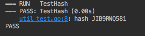

# go 单元测试

1. 文件以_test 结尾


2. 函数以Test开头


3. 入参为 t *testing.T

``` go
func Test(t *testing.T) {
	var root *models.FileTreeNode
	root = models.CreateNode("A",false)
	fmt.Println(root)
}
```
4. 命令

* go test */*_test.go
```
ok      command-line-arguments  0.010s
```
*  go test -v */*_test.go
```
=== RUN   Test
&{false <nil> <nil> A}
--- PASS: Test (0.00s)
PASS
ok      command-line-arguments  0.013s
```


5. 日志输出
   使用 t.Log(...)
   ```go
   t.Log("hash", Hash("ddd", 10))
   ```
   
## 疑问
1. go test 时  undefined: BinaryTreeConvertMutliTree
**解决**
直接用golang的测试工具... 真香


